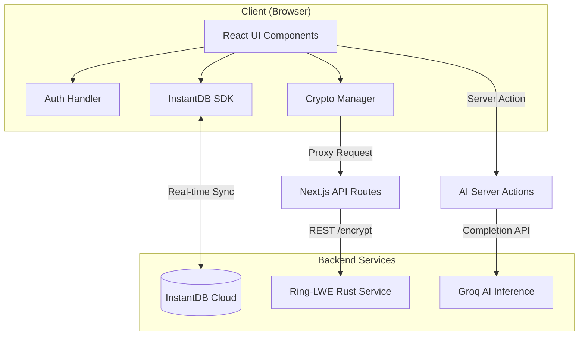

# 01. Architecture Overview

## System Philosophy
QMail is designed as a **"Thick Client"** application where the majority of logic, including cryptography management and data queries, happens in the browser. It relies on specialized backend services only for specific high-compute or secure tasks (AI and Ring-LWE).

## Technology Stack

### Frontend / Core
*   **Framework**: [Next.js 15](https://nextjs.org/) (App Router)
*   **Language**: TypeScript
*   **Styling**: TailwindCSS, Shadcn UI
*   **Data Fetching**: InstantDB React SDK (Real-time, Optimistic updates)

### Database Layer
*   **Provider**: [InstantDB](https://www.instantdb.com/)
*   **Type**: Graph-based / Relational NoSQL
*   **Authentication**: InstantDB Auth (Email/Magic Code)

### Microservices
#### 1. Security Sidecar (Ring-LWE)
A high-performance Rust service responsible for Post-Quantum cryptographic primitives.
*   **Language**: Rust (Axum)
*   **Role**: Key Generation, Message Encryption/Decryption.
*   **State**: Stateless.

#### 2. AI Engine
Server-side Next.js Actions interacting with LLMs.
*   **Provider**: Groq
*   **Model**: Llama-3.3-70b-versatile
*   **Role**: Content generation, prompt engineering, thread summarization.

## Component Diagram

## Application Flow
1.  **User Access**: Users log in via InstantDB Magic Code.
2.  **Data Sync**: The client subscribes to `boxes` (Inbox, Sent, etc.) and `mails`. Data updates are pushed in real-time.
3.  **Quantum Mode**: When enabled, the client communicates with the Ring-LWE service to generate keys. The *Public Key* is published to InstantDB, while the *Secret Key* is encrypted locally and stored.
4.  **AI Drafting**: When drafting an email, the client invokes a Server Action to generate text via Groq, which is then populated in the editor.
